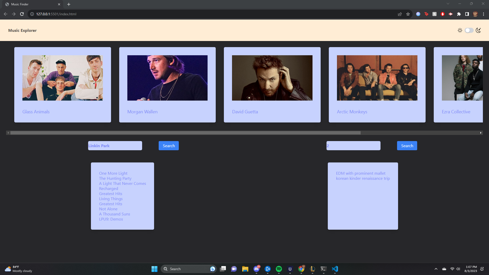
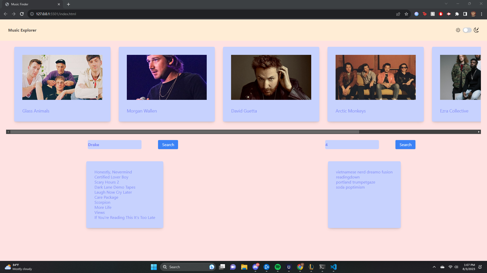

Music Exploration is a website that is focused on giving you an easy to access, clear way of finding more music. If you have the name of an artist, you can search their name and find more music from them. If you're feeling more adventurous, you can use our random genre generator.

For the bootcamp, this is our first group project. It's focused on javascript/APIs, but there are also elements that we learned from week 1 that are essential for this project. 

Our group consisted of Caitlin Ash, Jack Stendeback, and Alex Blaylock. As a group we had a lot of obstacles. Like other groups, we found a lot of unforeseen problems with the APIs and had to pivot our project a lot. Originally this was going to be an event finder, then it was going to be a music finder that would help you find artists in the same genre, but we ended up having to settle with what we have now.

Some other obstacles we faced we were a lot more standard, we faced problems trying to fetch our APIs, making a L&D mode, and overall just had a lot of trial and error processes.

Citations:
https://stackoverflow.com/questions/64301191/save-a-dark-mode-checkbox-toggle-to-local-storage

https://www.youtube.com/watch?v=rFAATv30v4Y

Special thank yous to our instructors Thomas Hearne and Matthew Bronstein, for helping us a lot getting on the right track involving our light and dark modes, and also our APIs.

Screenshots:

Page: https://bycait27.github.io/music-exploration/

Repo: https://github.com/bycait27/music-exploration